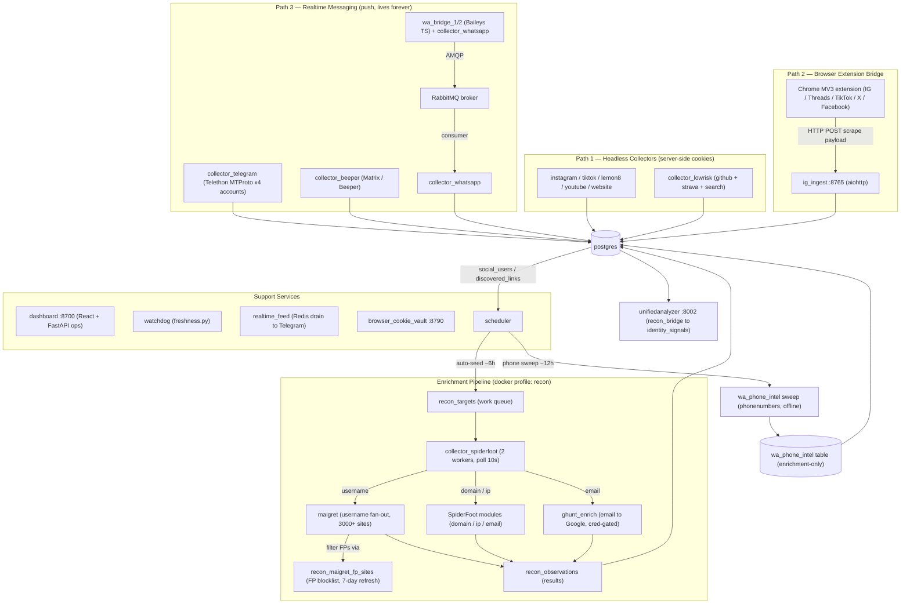
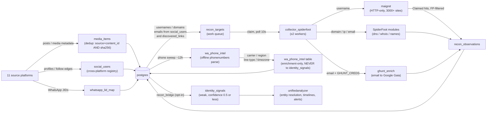
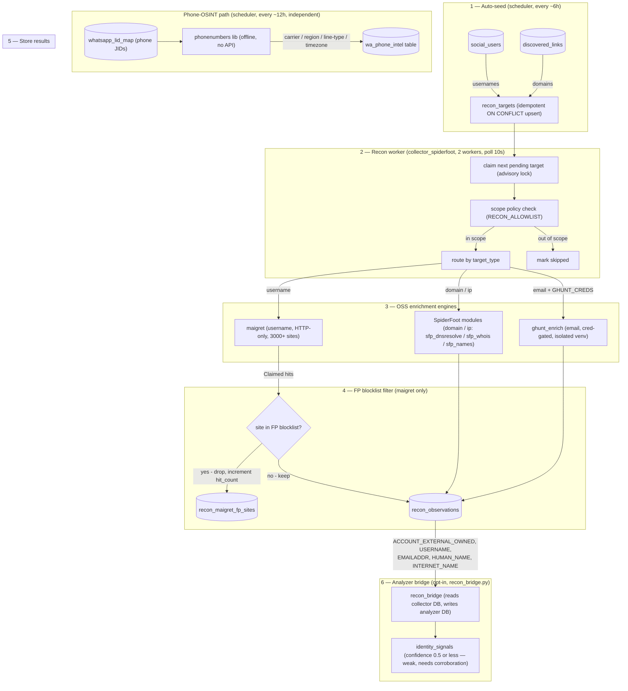
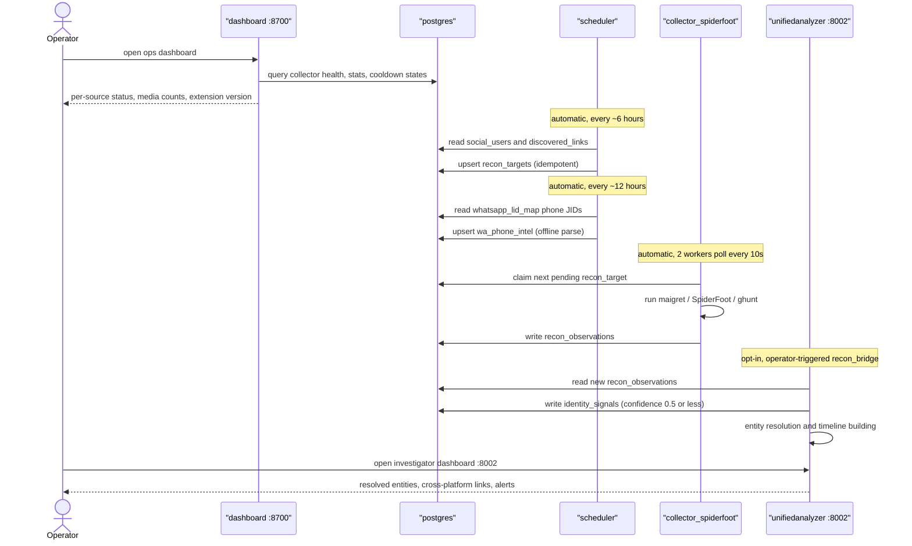

# unifiedcollector

Unified ingestion plane for **11 source platforms** — github, youtube, strava,
search, website, tiktok, lemon8, whatsapp, telegram, instagram, and
beeper/matrix. Read-only by design. Feeds a downstream **unifiedanalyzer** that
does identity resolution, face clustering, timelines, co-presence, and
change-tracking.

> **Quick orientation**: three collection paths feed one shared Postgres
> database. An enrichment pipeline (docker profile `recon`) automatically derives
> OSINT observations from collected identifiers. The analyzer reads both.

## Contents

- [Architecture overview](#architecture-overview)
- [Collection paths: three ways in](#collection-paths-three-ways-in)
- [Data flow](#data-flow)
- [Support services](#support-services)
- [Key mechanisms](#key-mechanisms)
- [Enrichment pipeline](#enrichment-pipeline)
- [User flow and operator guide](#user-flow-and-operator-guide)
- [Configuration reference](#configuration-reference)
- [Outbound functionality — intentionally absent](#outbound-functionality--intentionally-absent)
- [License](#license)

---

## Architecture overview

Everything runs as Docker Compose services sharing one Postgres database. Code
lives under `src/` and is **bind-mounted** into every container — changes apply
on `docker restart` / `docker compose up -d` without an image rebuild (the VHDX
must not grow).



---

## Collection paths: three ways in

### Path 1 — Headless collectors

Server-side scraping with stored cookies (`src/collectors/<source>/`). Each
source runs as a dedicated container (`python -m src.main worker --source X`) to
prevent a blocking subprocess (yt-dlp, gallery-dl) from wedging the shared event
loop. `init: true` on youtube and tiktok containers reaps zombie child processes
so a container `recreate` can't block on a defunct PID.

| Container | Sources | Memory cap | Notes |
|---|---|---|---|
| `collector_youtube` | youtube | 1300 MiB | yt-dlp; isolated for SIGCHLD safety |
| `collector_tiktok` | tiktok | 1300 MiB | gallery-dl + yt-dlp fallback, both enabled here |
| `collector_instagram` | instagram | 1300 MiB | headless + browser rotator |
| `collector_lemon8` | lemon8 | 1300 MiB | |
| `collector_website` | website | 1300 MiB | spider-discovers new targets via `discovered_links` |
| `collector_lowrisk` | github + strava + search | 2560 MiB | merged to reclaim ~1.5 GiB Python-interpreter baseline RSS |

The main `collector` container idles (all sources disabled via
`COLLECTOR_DISABLED_SOURCES`). It exists as the canonical image builder and a
safety net for ad-hoc `docker exec` work.

### Path 2 — Browser extension bridge

"UnifiedCollector Bridge" (Chrome MV3, `extension/`). A content-script loop
runs inside your logged-in browser tabs and scrapes Instagram, Threads, TikTok,
Lemon8, X, and Facebook following-first, then POSTs batches to `ig_ingest`
(:8765).

This is the **ban-safe primary path for Meta and X**: requests originate from a
real, authenticated browser session, which bypasses server-side IP and account
blocks. The extension maintains persistent throttle walls that survive tab
refresh. The `ig_ingest` service coordinates anti-ban cooldown state via
`/social/ig_cooldown` so the headless and extension paths share one backoff
signal.

### Path 3 — Realtime messaging

Push sources that maintain a persistent long-lived connection:

- **Telegram** (`collector_telegram`) — Telethon MTProto with 4 accounts. Live
  `NewMessage` / edits / deletes / reactions plus full-history backfill to 2018
  (= account age). Watchdog-monitored: a dead MTProto connection was previously
  silent for 26 hours before manual detection.
- **WhatsApp** (`wa_bridge_1/2` + `collector_whatsapp`) — Two Baileys TypeScript
  bridges (`src/bridges/whatsapp`) push raw messages over AMQP into RabbitMQ.
  `collector_whatsapp` is the consumer. On-demand deep history backfill
  (effectively unlimited, `WHATSAPP_MAX_BACKFILL_AGE_DAYS=36500`) plus live
  messages and message revokes.
- **Beeper** (`collector_beeper`) — Matrix/Beeper bridge, multi-network
  (Facebook Messenger, Discord, etc.), reaches content back to ~2011.

---

## Data flow

Sources on the left; the analyzer and derived signals on the right.



---

## Support services

### `ig_ingest` (:8765)

aiohttp HTTP bridge. Receives browser-extension POST batches and writes
`media_items`, posts, and `social_users`. Additional endpoints:

- `/social/cookies` — live Instagram cookie sync from the extension
- `/social/ig_cooldown` — anti-ban cooldown coordination shared by the headless
  and extension paths
- Threads ↔ Instagram handle cross-pollination on write

### `dashboard` (:8700)

React/Vite frontend + FastAPI backend. **Collection operations only**: collector
health, media browser, per-source counts, live status, anti-ban cooldown state,
extension version check (`UC_EXTENSION_EXPECTED_VERSION`). Intentionally stays
in its lane — the analyzer (:8002) owns investigation, entity timelines, and
identity resolution.

`DASHBOARD_AUTH_DISABLED=true` for localhost single-user deployments. Remove
for any network exposure.

### `watchdog` (`src/watchdog/freshness.py`)

Data-freshness safety net. Monitors the newest `media_items` row timestamp per
source. When a source goes stale beyond the threshold, it restarts the
responsible container via the Docker socket. The container healthcheck only
tests an HTTP endpoint, so a dead MTProto or Baileys connection would otherwise
sit silently for hours. Prior incidents: Telegram silent 26 h, WhatsApp silent
4 d. The watchdog exists specifically to catch those failures.

### `realtime_feed` (`src/notifications/realtime_feed.py`)

Every successful `media_items` insert fire-and-forgets an enqueue to Redis key
`uc:realtime_post_feed`. A drain process reads that queue and sends a per-post
Telegram message (local-file multipart upload). Features:

- Token-bucket rate limit (default 18/min via `REALTIME_POST_FEED_MAX_PER_MINUTE`)
- 7-day per-source sha256 / source-url dedupe: replayed or duplicate media
  doesn't re-spam the operator
- Video poster / cover-thumbnail skipping by default
  (`REALTIME_POST_FEED_SKIP_VIDEO_THUMBNAILS=1`)
- 15-minute burst summary when the rate cap engages

Companion services: hourly digest (`src/notifications/status.py`), 15-minute
delta (`src/notifications/status_delta.py`).

### `browser_cookie_vault` (:8790)

Snapshots every social cookie from the host Chrome instance via CDP every 5
minutes (default). Keeps 10 rotating snapshots plus `latest.json`. On container
start with `BROWSER_COOKIE_VAULT_AUTORESTORE=1`, pushes cookies back into
Chrome — so a profile wipe or clean-cookie event doesn't strand collectors
waiting for fresh sessions. The watchdog trusts the last-backup timestamp
reported at `/health`.

### Infrastructure

| Service | Role |
|---|---|
| `postgres` (pgvector/pg16) | Unified database. All containers share one instance; per-container pool sizes are tuned to stay under `max_connections=200`. |
| `rabbitmq` (3.13-alpine) | WhatsApp AMQP broker. The AMQP port (5672) is internal-only on the Docker network. |
| `redis` (7-alpine) | Realtime post-feed queue (`uc:realtime_post_feed`) + anti-ban dedup cache. |
| `scheduler` | `python -m src.main scheduler`. Periodic reconciliation, recon auto-seed (~6h), phone-OSINT sweep (~12h), and other maintenance jobs. |
| `onboard_bot` | Telegram onboarding assistant (`src/bots/onboard_bot.py`). |
| `backup` | Daily pg_dump to `Z:/unifiedcollector/backups/db` with verified-write semantics: dump to temp, validate with `pg_restore --list`, then rename atomically. Retry on failure; Telegram alert on failure. Retention: 7 daily / 4 weekly / 3 monthly. |

---

## Key mechanisms

### `media_items` — unified media table

One table for all downloaded media from every source. Dedup is enforced at two
independent levels:

- `(source, content_id)` UNIQUE — prevents re-ingesting the same platform item
- `sha256` — cross-collector content dedup; the same binary file arriving via
  two collectors is stored once

File naming: `<YYYYMMDD>_<platform>_<user>_<kind><id>.<ext>` — flat, dated,
human-scannable.

### `source_url` contract

Every `media_items` row carries `source_url`: the canonical human-openable URL
for the content's source page (video / post / profile). Each collector derives
it in a `_build_<source>_source_url()` `@staticmethod` called inside
`insert_media_item()`. Platforms without a public URL use a stable URI scheme
(`whatsapp://<chat_jid>/<msg_id>`) or NULL for private Telegram DMs. The
dashboard monitors fresh-inflow `source_url` coverage as a health signal.

### `ingest_path` — provenance tag

Every row is tagged with how it arrived:

| Value | Meaning |
|---|---|
| `headless` | Server-side scrape |
| `extension` | Browser-observed via Chrome MV3 extension |
| `messaging` | Realtime Telegram / WhatsApp / Beeper |
| `mobile_api` | Scaffolded; off by default |

Default from the collector's `INGEST_PATH` class attribute; the extension
bridge sets it inline.

### `social_users` — cross-platform person registry

Universal registry of profiles encountered during collection: usernames,
platform IDs, profile photos, and relationship contexts (follow, comment,
tagged, author). The analyzer's entity resolution reads this table as its
primary input.

### Deletion tracking

- Telegram: `metadata->>'deleted'` + `deleted_at`
- WhatsApp / Beeper: `is_deleted` + `deleted_at` (partial-indexed)

The analyzer uses these fields for "what changed since last viewed" timelines.

### Anti-ban

- **Headless**: exponential 429 backoff (15 min to 4 h), persisted in the
  database so a container restart doesn't reset the cooldown window.
- **Extension**: persistent throttle walls surviving tab refresh.
- **Both**: cooperate via `ig_cooldown` in `ig_ingest` — a headless 429 pauses
  the extension and vice versa.

### Migrations

`migrate-on-boot` is applied by every container on startup, tracked in a
`schema_migrations` ledger with checksums. **Never edit an applied migration
file** — checksum drift bricks every container on next boot. Always add a new
migration file.

---

## Enrichment pipeline

An OSS OSINT layer that automatically turns collected identifiers (usernames,
phone numbers, email addresses, domains) into structured observations. Ships
enabled by default under docker profile `recon`. No outbound: the pipeline
reads from the collector DB and writes back into it; it never posts to any
source platform.

There are two parallel enrichment paths:

1. **Recon path** — usernames, domains, emails, and IPs are queued as
   `recon_targets` and processed by `collector_spiderfoot` (maigret, SpiderFoot
   modules, GHunt). Results go to `recon_observations` and can be bridged into
   the analyzer as weak identity signals.
2. **Phone-OSINT path** — WhatsApp JIDs are parsed offline through the
   `phonenumbers` library. Results go to `wa_phone_intel` and are
   **enrichment-only** — never forwarded to `identity_signals`.

Policy enforcement prevents unauthorized enrichment: `RECON_ALLOWLIST` gates
which targets are processed. With `RECON_ALLOW_UNSCOPED=0` (default), only
targets derived from collector data are eligible.

### Enrichment workflow



### maigret — username fan-out engine

[maigret](https://github.com/soxoj/maigret) (MIT) runs HTTP-only against 3000+
sites and reports `Claimed` / `Not Claimed` per site. It replaced the dead
`sfp_accounts` SpiderFoot module. Default ON: `RECON_USERNAME_ENGINE=maigret`.

**FP blocklist** (`recon_maigret_fp_sites`): built by running maigret against
random 16-character control usernames and caching the union of their `Claimed`
results (sites like xvideos, roblox, op.gg, twitchtracker that return a hit for
any username). Refreshed every ~7 days using 10 control usernames (both
env-tunable). This cut the false-positive rate from ~76% to ~90%+ clean
observations. Per-observation confidence: 0.7 for top-500 Alexa rank, 0.5
otherwise.

The FP-refresh loop runs inside `collector_spiderfoot` itself (not the
scheduler) because it needs the `maigret` binary. It serializes across workers
via a Postgres advisory lock. A 30-second warm-up jitter prevents a batch
restart from dogpiling all workers on refresh simultaneously.

| Env var | Default | Notes |
|---|---|---|
| `RECON_USERNAME_ENGINE` | `maigret` | Route username targets through maigret |
| `MAIGRET_TOP_SITES` | `300` | Sites checked per target |
| `MAIGRET_NUM_REQUESTS` | `20` | Concurrent HTTP requests per target |
| `MAIGRET_HTTP_TIMEOUT_SECONDS` | `10` | Per-request timeout |
| `MAIGRET_TARGET_TIMEOUT_SECONDS` | `420` | Hard wall-clock timeout per username |
| `RECON_MAIGRET_FP_CONTROLS` | `10` | Control usernames used for FP discovery |
| `RECON_MAIGRET_FP_INTERVAL_SECONDS` | `604800` | FP blocklist refresh interval (7 days) |

### Phone-OSINT — offline enrichment

`wa_phone_intel` (`src/core/wa_phone_intel.py`) reads WhatsApp JIDs from
`whatsapp_lid_map`, parses the digits through the
[phonenumbers](https://github.com/daviddrysdale/python-phonenumbers) library
(pure Python, offline dataset, no API key, no network), and upserts results
into the `wa_phone_intel` table. ~17k WhatsApp numbers were backfilled on
initial deployment.

Extracted fields: carrier name, region code (ISO 3166-1), line type
(`MOBILE` / `FIXED_LINE` / `VOIP` / etc.), timezone(s).

**Policy**: carrier and region metadata is **enrichment-only**. These fields
don't identify individuals and are **never** written to `identity_signals`.
See `src/core/wa_phone_intel.py` docstring. Same policy as `wa_devices`.

### GHunt — email to Google account (credential-gated)

[GHunt](https://github.com/mxrch/GHunt) resolves a Gmail address to the
attached Google Account: Gaia ID, display name, profile photo, public reviews,
YouTube channel. GHunt is installed in an isolated venv baked into
`Dockerfile.spiderfoot`. **Off by default** — without credentials it does nothing.

**Operator setup**:
1. Install GHunt: `pipx install ghunt` (or into a venv)
2. Install the GHunt Companion browser extension (Firefox or Chrome)
3. Run `ghunt login`, choose option 1 (Companion listener), authenticate in the
   extension against a **throwaway** Google account; this writes
   `~/.malfrats/ghunt/creds.m`
4. Set `GHUNT_CREDS=/path/to/creds.m` in `.env`. Never commit `creds.m`.

Without `GHUNT_CREDS` set, or without a resolvable `ghunt` binary,
`ghunt_enrich.run_lookup()` returns `{"status": "skipped"}` and executes
nothing. It never fabricates a Google profile.

**Operator cautions**: GHunt hits unofficial Google endpoints (likely violates
ToS). Use a throwaway account. Rate-limit aggressively. Results are evidence
in `recon_observations`, not automatic identity claims. Depending on
jurisdiction, systematic profile collection may trigger privacy law (GDPR,
PDPA). This is the operator's responsibility.

### Stale-target reclaim

Targets claimed by a worker but not completed within
`SPIDERFOOT_STALE_TARGET_MINUTES` (default 30) are automatically reclaimed on
the next poll cycle. This handles interrupted maigret runs cleanly — a
container restart re-processes in-progress targets rather than leaving them
permanently stuck.

### Analyzer bridge

`recon_bridge.py` (in the unifiedanalyzer, `src/pipeline/recon_bridge.py`)
reads `recon_observations` from the collector DB and writes `identity_signals`
into the analyzer DB, joined to `entities` via `entity_platform_links` (case-
insensitive, active links only). It is idempotent (skips already-bridged
observation IDs) and bounded (`--limit`, default 500, to allow dry-run
validation before a large batch).

Observation types map to signal types:

| Observation type | Signal type | Confidence |
|---|---|---|
| `ACCOUNT_EXTERNAL_OWNED` | `cross_platform_link` | 0.50 |
| `SIMILAR_ACCOUNT_EXTERNAL` | `cross_platform_link` | 0.25 |
| `USERNAME` (different from target) | `cross_platform_username` | 0.40 |
| `EMAILADDR` | `email_lead` | 0.40 |
| `HUMAN_NAME` | `name_lead` | 0.40 |
| `INTERNET_NAME` | `domain_lead` | 0.30 |

All signals are weak (confidence ≤ 0.5). The analyzer's `identity_truth`
module requires independent hard signals before promoting to `auto_truth`.

---

## User flow and operator guide

### How the system looks to an operator



### Startup

```bash
cp .env.example .env     # fill POSTGRES_USER, POSTGRES_PASSWORD, etc.

# Core collection stack only
docker compose -f docker/docker-compose.yml up -d

# Core + enrichment pipeline (adds collector_spiderfoot)
docker compose -f docker/docker-compose.yml --profile recon up -d
```

Dashboard at **http://localhost:8700** (also mapped to :8001). Analyzer at
**http://localhost:8002**.

### Live code changes

All containers bind-mount `../src:/app/src`. Code changes apply on:

```bash
docker compose restart <service>
# or, to pick up new env vars without an image rebuild:
docker compose up -d
```

A full image rebuild is needed only when `requirements.txt` changes or a
Dockerfile layer changes.

### Manual enrichment operations

```bash
# Seed recon targets from current social_users and discovered_links (dry-run first)
docker exec unifiedcollector_scheduler \
  python -m src.recon_seed_service --limit 200 --dry-run

docker exec unifiedcollector_scheduler \
  python -m src.recon_seed_service --limit 200

# Full WhatsApp phone-OSINT backfill (~17k numbers)
docker exec unifiedcollector_collector \
  python -m src.core.wa_phone_intel --limit 20000

# Force-refresh the maigret FP blocklist now (rather than waiting for the ~7-day tick)
docker exec unifiedcollector_spiderfoot \
  python -m src.recon_maigret_fp_refresh --controls 10 --force

# Run recon worker once for inspection (dry-run)
docker exec unifiedcollector_spiderfoot \
  python -m src.recon_spiderfoot_service --once --dry-run

# Bridge collector observations into analyzer identity_signals (from analyzer container)
python -m src.pipeline.recon_bridge --dry-run
python -m src.pipeline.recon_bridge
```

### Migrations

Never edit an applied migration file — checksum drift bricks every container on
next boot. Always add a new `.py` file under `src/migrations/` or via
`scripts/`. The `schema_migrations` table tracks what has been applied.
Migrations run idempotently on every container start.

---

## Configuration reference

### Enrichment (collector_spiderfoot + scheduler)

| Variable | Default | Description |
|---|---|---|
| `RECON_ALLOWLIST` | _(empty)_ | Comma-separated domains / values in scope. Empty + `RECON_ALLOW_UNSCOPED=0` means only collector-derived targets are processed. |
| `RECON_ALLOW_UNSCOPED` | `0` | `1` allows targets outside the allowlist. Use with care. |
| `RECON_USERNAME_ENGINE` | `maigret` | `maigret` or `sfp_accounts`. sfp_accounts is dead upstream; maigret is the working replacement. |
| `RECON_SPIDERFOOT_WORKERS` | `2` | Concurrent worker count inside `collector_spiderfoot`. |
| `RECON_SPIDERFOOT_POLL_INTERVAL` | `10` (s) | Idle poll interval when no targets are pending. |
| `SPIDERFOOT_ALLOW_INTRUSIVE` | `0` | Enable port scans, Shodan, Censys. Blocked by default. |
| `SPIDERFOOT_STALE_TARGET_MINUTES` | `30` | Minutes before an in-progress target is reclaimed. |
| `GHUNT_CREDS` | _(unset)_ | Path to GHunt `creds.m`. Unset = GHunt fully disabled. |
| `MAIGRET_TOP_SITES` | `300` | Sites checked per username target. |
| `MAIGRET_TARGET_TIMEOUT_SECONDS` | `420` | Hard wall-clock timeout per username. |
| `RECON_MAIGRET_FP_CONTROLS` | `10` | Control usernames for FP-blocklist discovery. |
| `RECON_MAIGRET_FP_INTERVAL_SECONDS` | `604800` | FP blocklist refresh interval (7 days). Set to `0` to disable. |

### Dynamic resource caps

Durable across `docker compose up -d`; also live-applicable via `docker update`:

| Variable | Default | Container |
|---|---|---|
| `COLLECTOR_SCHED_MEM` | `512m` | `scheduler` |
| `COLLECTOR_SCHED_CPUS` | `1.0` | `scheduler` |
| `RECON_SPIDERFOOT_MEM` | `2g` | `collector_spiderfoot` |
| `RECON_SPIDERFOOT_CPUS` | `2.0` | `collector_spiderfoot` |

---

## Outbound functionality — intentionally absent

Unified collector is read-only by design. The following were **intentionally
dropped** during the Wave 2 port — they are not regressions and must not be
restored as missing functionality:

- **Telegram**: `shared/media_uploader.py`, `src/managers/resender.py`,
  `src/managers/send_photos.py`
- **WhatsApp**: `services/bulk_sender/`
- **Generic (across platforms)**: send / reply / react / edit / delete / typing
  indicators / mark-as-read / bot-command-handler

**Rationale**: collection without contamination. This service observes and
archives; it never writes back to a source platform. Mixing outbound primitives
into the collector creates ambiguity about whether a message in the unified DB
originated from a real user or from automation, and materially raises the blast
radius of any bug or credential leak.

If outbound is needed for a specific use-case, build it as a **separate service
that consumes the unified DB**. Original outbound implementations are archived
under `archive/` for reference.

---

## License

Apache-2.0. See [LICENSE](LICENSE) and [NOTICE](NOTICE).
