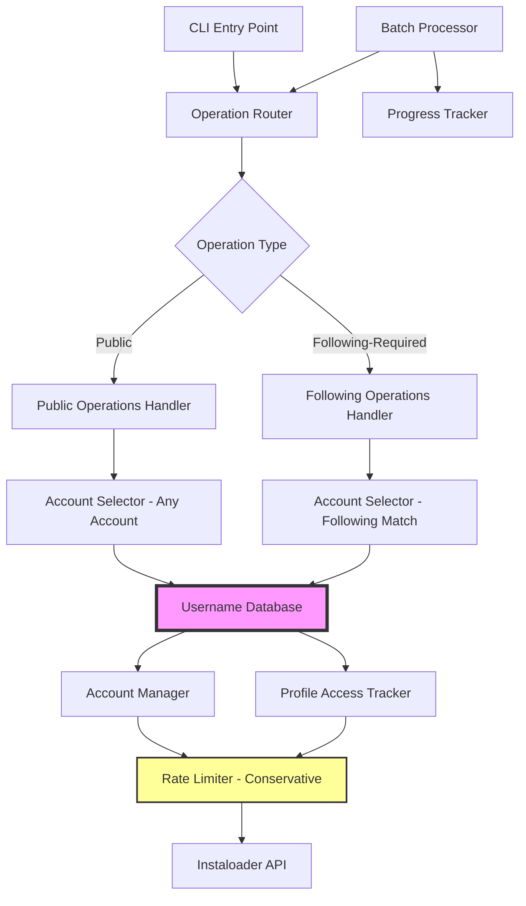
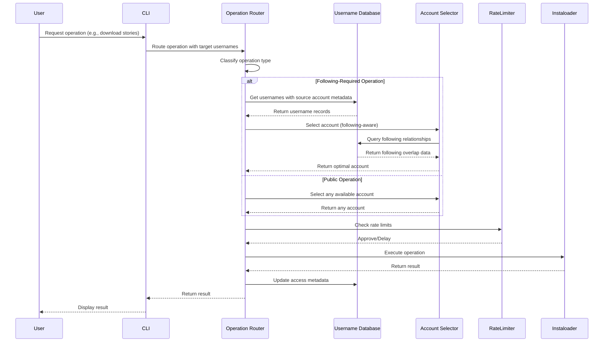

# Design Document: Account-User Tracking and Operation Decoupling

## Overview

This design enhances the Instagram scraping toolkit with intelligent account-user relationship tracking and operation decoupling based on access requirements. Currently, the system stores usernames in a monolithic flat file (data/usernames.txt) with no metadata about which account scraped which users, making targeted re-scraping impossible. Additionally, all operations are coupled together regardless of access requirements - profile photo downloads (public) require the same account selection logic as stories (following-required), leading to inefficient account usage and increased rate limiting risk.

The solution introduces a structured username database that tracks source accounts, implements operation classification by access requirements (public vs following-required), and provides smart account selection based on following relationships. This enables efficient re-scraping of specific account followers, optimal account rotation, and more conservative rate limiting to avoid bans in the absence of proxy infrastructure.


## Architecture



### Key Architectural Changes

1. **Username Database** (new): Replaces flat file with structured JSON storage tracking source accounts
2. **Operation Router** (new): Classifies operations and routes to appropriate handlers
3. **Smart Account Selector** (enhanced): Selects accounts based on following relationships
4. **Conservative Rate Limiter** (enhanced): More aggressive delays and cooldowns


## Main Algorithm/Workflow




## Components and Interfaces

### Component 1: UsernameDatabase

**Purpose**: Structured storage for usernames with source account tracking and metadata

**Interface**:
```python
class UsernameDatabase:
    def add_username(self, username: str, source_account: str, metadata: dict) -> bool
    def get_usernames_by_source(self, source_account: str) -> list[UsernameRecord]
    def get_all_usernames(self) -> list[UsernameRecord]
    def get_username_record(self, username: str) -> UsernameRecord | None
    def update_metadata(self, username: str, metadata: dict) -> bool
    def remove_username(self, username: str) -> bool
    def migrate_from_flat_file(self, filepath: str, default_source: str) -> int
    def export_to_flat_file(self, filepath: str) -> int
```

**Responsibilities**:
- Store username records with source account attribution
- Track when each username was added and last accessed
- Provide query interface for filtering by source account
- Support migration from existing flat file format
- Maintain backward compatibility with export to flat file

### Component 2: OperationClassifier

**Purpose**: Classify Instagram operations by access requirements

**Interface**:
```python
class OperationClassifier:
    def classify(self, operation_name: str) -> OperationType
    def requires_following(self, operation_name: str) -> bool
    def is_public_operation(self, operation_name: str) -> bool
    def get_operation_metadata(self, operation_name: str) -> OperationMetadata
```

**Responsibilities**:
- Maintain registry of operation types and their access requirements
- Classify operations as PUBLIC, FOLLOWING_REQUIRED, or MUTUAL_FOLLOWING_REQUIRED
- Provide metadata about rate limit sensitivity per operation type

### Component 3: SmartAccountSelector

**Purpose**: Select optimal Instagram account based on operation requirements and following relationships

**Interface**:
```python
class SmartAccountSelector:
    def select_for_operation(
        self, 
        operation_type: OperationType, 
        target_username: str,
        available_accounts: list[str]
    ) -> str | None
    
    def select_for_batch(
        self,
        operation_type: OperationType,
        target_usernames: list[str],
        available_accounts: list[str]
    ) -> dict[str, list[str]]  # account -> usernames mapping
    
    def get_following_overlap(
        self,
        account: str,
        target_usernames: list[str]
    ) -> dict[str, bool]  # username -> is_following
```

**Responsibilities**:
- Select accounts based on following relationships for following-required operations
- Use any available account for public operations
- Optimize batch operations by grouping usernames by optimal account
- Query profile_access_tracker for following relationship data

### Component 4: ConservativeRateLimiter

**Purpose**: Enhanced rate limiting with more aggressive delays to avoid bans

**Interface**:
```python
class ConservativeRateLimiter(RateLimiter):
    def operation_delay(self, operation_type: OperationType) -> None
    def account_switch_delay(self) -> None
    def following_enumeration_delay(self, count: int) -> None
    def emergency_cooldown(self, account: str, duration_minutes: int) -> None
    def check_account_available(self, account: str) -> bool
```

**Responsibilities**:
- Implement operation-specific delays (longer for sensitive operations)
- Enforce mandatory delays between account switches
- Add progressive delays during follower/following enumeration
- Track and enforce per-account cooldown periods
- Prevent operations on accounts in cooldown


## Data Models

### Model 1: UsernameRecord

```python
class UsernameRecord:
    username: str                    # Instagram username
    source_account: str              # Account that scraped this username
    added_timestamp: float           # Unix timestamp when added
    added_datetime: str              # ISO format datetime
    last_accessed: float | None      # Last time this username was processed
    metadata: dict                   # Additional metadata (tags, notes, etc.)
    following_status: dict[str, bool] # account_name -> is_following mapping
```

**Validation Rules**:
- username must be valid Instagram username format (alphanumeric, dots, underscores)
- source_account must exist in INSTAGRAM_ACCOUNTS config
- added_timestamp must be positive number
- metadata must be JSON-serializable dict

### Model 2: OperationType

```python
from enum import Enum

class OperationType(Enum):
    PUBLIC = "public"                           # Any account can perform
    FOLLOWING_REQUIRED = "following_required"   # Must follow target
    MUTUAL_FOLLOWING = "mutual_following"       # Must be mutually following
```

### Model 3: OperationMetadata

```python
class OperationMetadata:
    name: str                        # Operation name (e.g., "download_stories")
    operation_type: OperationType    # Access requirement classification
    rate_limit_weight: int           # 1-10 scale of rate limit sensitivity
    description: str                 # Human-readable description
```

**Validation Rules**:
- rate_limit_weight must be between 1 and 10
- name must be unique across all operations

### Model 4: UsernameDatabase Storage Format

```python
{
    "version": "1.0",
    "last_updated": "2024-01-15T10:30:00",
    "usernames": {
        "username1": {
            "source_account": "account1",
            "added_timestamp": 1705315800.0,
            "added_datetime": "2024-01-15T10:30:00",
            "last_accessed": 1705402200.0,
            "metadata": {
                "tags": ["priority", "verified"],
                "notes": "High-value target"
            },
            "following_status": {
                "account1": true,
                "account2": false
            }
        }
    },
    "source_accounts": {
        "account1": {
            "username_count": 1500,
            "last_scrape": "2024-01-15T10:30:00"
        }
    }
}
```


## Algorithmic Pseudocode

### Main Processing Algorithm

```python
def process_operation_with_smart_routing(operation_name: str, target_usernames: list[str]) -> dict:
    """
    Main algorithm for processing operations with smart account selection.
    
    Preconditions:
    - operation_name is a valid registered operation
    - target_usernames is a non-empty list of valid usernames
    - At least one account is available and not in cooldown
    
    Postconditions:
    - All usernames are processed or marked as failed
    - Username database is updated with access metadata
    - Rate limits are respected throughout execution
    - Returns summary with success/failure counts
    
    Loop Invariants:
    - All processed usernames have updated metadata
    - Rate limiter state remains consistent
    - No account exceeds cooldown threshold
    """
    # Step 1: Classify operation
    classifier = OperationClassifier()
    operation_type = classifier.classify(operation_name)
    operation_metadata = classifier.get_operation_metadata(operation_name)
    
    # Step 2: Load username records
    username_db = UsernameDatabase()
    username_records = [username_db.get_username_record(u) for u in target_usernames]
    
    # Step 3: Select accounts based on operation type
    account_selector = SmartAccountSelector()
    available_accounts = get_available_accounts()  # Excludes accounts in cooldown
    
    if operation_type == OperationType.PUBLIC:
        # Any account works for public operations
        account_assignment = {available_accounts[0]: target_usernames}
    else:
        # Following-required: group by optimal account
        account_assignment = account_selector.select_for_batch(
            operation_type,
            target_usernames,
            available_accounts
        )
    
    # Step 4: Process each account's batch
    rate_limiter = ConservativeRateLimiter()
    results = {"success": [], "failed": []}
    
    for account_name, usernames in account_assignment.items():
        # Check account availability
        if not rate_limiter.check_account_available(account_name):
            results["failed"].extend(usernames)
            continue
        
        # Login to account
        account_manager = InstagramAccountManager()
        loader = account_manager.get_authenticated_loader(account_name)
        
        if not loader:
            results["failed"].extend(usernames)
            continue
        
        # Process usernames for this account
        for i, username in enumerate(usernames):
            # Apply operation-specific rate limiting
            rate_limiter.operation_delay(operation_type)
            
            # Apply periodic pauses
            if i > 0 and i % 10 == 0:
                rate_limiter.following_enumeration_delay(i)
            
            try:
                # Execute operation
                success = execute_operation(loader, operation_name, username)
                
                if success:
                    results["success"].append(username)
                    # Update username metadata
                    username_db.update_metadata(username, {
                        "last_accessed": time.time(),
                        "last_operation": operation_name,
                        "last_account": account_name
                    })
                else:
                    results["failed"].append(username)
                    
            except RateLimitException as e:
                # Emergency cooldown
                rate_limiter.emergency_cooldown(account_name, duration_minutes=15)
                results["failed"].extend(usernames[i:])  # Mark remaining as failed
                break
            except Exception as e:
                results["failed"].append(username)
                log_error(f"Error processing {username}: {e}")
        
        # Account switch delay before next account
        if account_name != list(account_assignment.keys())[-1]:
            rate_limiter.account_switch_delay()
    
    return {
        "total": len(target_usernames),
        "success_count": len(results["success"]),
        "failed_count": len(results["failed"]),
        "results": results
    }
```

### Smart Account Selection Algorithm

```python
def select_account_for_following_operation(
    target_username: str,
    available_accounts: list[str],
    username_db: UsernameDatabase,
    profile_tracker: ProfileAccessTracker
) -> str | None:
    """
    Select optimal account for following-required operation.
    
    Preconditions:
    - target_username is valid
    - available_accounts is non-empty list of account names
    - username_db and profile_tracker are initialized
    
    Postconditions:
    - Returns account name that follows target, or None if no match
    - Prioritizes accounts with confirmed following relationship
    
    Loop Invariants:
    - All checked accounts are in available_accounts list
    - Following status checks are consistent with profile_tracker data
    """
    # Step 1: Get username record
    record = username_db.get_username_record(target_username)
    
    # Step 2: Check following status from username record
    if record and record.following_status:
        for account in available_accounts:
            if record.following_status.get(account, False):
                return account  # Found account that follows target
    
    # Step 3: Check profile access tracker
    profile_summary = profile_tracker.get_profile_summary(target_username)
    accessible_by = profile_summary.get("accessible_by", [])
    
    for account in available_accounts:
        if account in accessible_by:
            # Update username record with this information
            if record:
                if not record.following_status:
                    record.following_status = {}
                record.following_status[account] = True
                username_db.update_metadata(target_username, {
                    "following_status": record.following_status
                })
            return account
    
    # Step 4: Try source account (likely follows if it scraped this username)
    if record and record.source_account in available_accounts:
        return record.source_account
    
    # Step 5: No following relationship found
    return None
```

### Username Database Migration Algorithm

```python
def migrate_flat_file_to_database(
    flat_file_path: str,
    default_source_account: str,
    username_db: UsernameDatabase
) -> dict:
    """
    Migrate existing flat file usernames to structured database.
    
    Preconditions:
    - flat_file_path exists and is readable
    - default_source_account is valid account name
    - username_db is initialized
    
    Postconditions:
    - All valid usernames from flat file are in database
    - Original flat file is backed up
    - Returns migration statistics
    
    Loop Invariants:
    - All processed usernames are either added or marked as invalid
    - Line count matches processed + skipped count
    """
    import shutil
    from datetime import datetime
    
    # Step 1: Backup original file
    backup_path = f"{flat_file_path}.backup.{int(time.time())}"
    shutil.copy2(flat_file_path, backup_path)
    
    # Step 2: Read usernames from flat file
    with open(flat_file_path, 'r', encoding='utf-8') as f:
        lines = f.readlines()
    
    # Step 3: Process each username
    stats = {"added": 0, "skipped": 0, "duplicates": 0, "invalid": 0}
    current_time = time.time()
    
    for line in lines:
        username = line.strip()
        
        # Skip empty lines
        if not username:
            stats["skipped"] += 1
            continue
        
        # Validate username format
        if not is_valid_instagram_username(username):
            stats["invalid"] += 1
            continue
        
        # Check if already exists
        existing = username_db.get_username_record(username)
        if existing:
            stats["duplicates"] += 1
            continue
        
        # Add to database
        success = username_db.add_username(
            username=username,
            source_account=default_source_account,
            metadata={
                "migrated_from_flat_file": True,
                "migration_timestamp": current_time,
                "original_line_number": lines.index(line) + 1
            }
        )
        
        if success:
            stats["added"] += 1
        else:
            stats["skipped"] += 1
    
    # Step 4: Save database
    username_db.save()
    
    return {
        "total_lines": len(lines),
        "backup_path": backup_path,
        "statistics": stats,
        "migration_timestamp": datetime.now().isoformat()
    }
```


## Key Functions with Formal Specifications

### Function 1: UsernameDatabase.add_username()

```python
def add_username(self, username: str, source_account: str, metadata: dict = None) -> bool:
    """Add a username to the database with source account tracking."""
```

**Preconditions:**
- `username` is non-empty string matching Instagram username format (^[a-zA-Z0-9._]+$)
- `source_account` exists in INSTAGRAM_ACCOUNTS configuration
- `metadata` is None or JSON-serializable dict
- Database file is writable

**Postconditions:**
- If username doesn't exist: new record created with current timestamp
- If username exists: existing record is preserved (no overwrite)
- Returns True if new record added, False if duplicate or error
- Database file is updated atomically
- No side effects on input parameters

**Loop Invariants:** N/A (no loops in function)

### Function 2: OperationClassifier.classify()

```python
def classify(self, operation_name: str) -> OperationType:
    """Classify an operation by its access requirements."""
```

**Preconditions:**
- `operation_name` is non-empty string
- Operation registry is initialized

**Postconditions:**
- Returns OperationType enum value (PUBLIC, FOLLOWING_REQUIRED, or MUTUAL_FOLLOWING)
- If operation_name not in registry, returns OperationType.PUBLIC (safe default)
- No mutations to internal state
- Deterministic output for same input

**Loop Invariants:** N/A (no loops in function)

### Function 3: SmartAccountSelector.select_for_batch()

```python
def select_for_batch(
    self,
    operation_type: OperationType,
    target_usernames: list[str],
    available_accounts: list[str]
) -> dict[str, list[str]]:
    """Group usernames by optimal account for batch processing."""
```

**Preconditions:**
- `operation_type` is valid OperationType enum value
- `target_usernames` is non-empty list of valid usernames
- `available_accounts` is non-empty list of account names
- All accounts in available_accounts exist in configuration

**Postconditions:**
- Returns dict mapping account names to username lists
- All input usernames appear exactly once in output values
- For PUBLIC operations: all usernames assigned to single account
- For FOLLOWING_REQUIRED: usernames grouped by following relationships
- If no following match found, username assigned to source account or first available
- Sum of all output list lengths equals len(target_usernames)

**Loop Invariants:**
- For each processed username: username appears in exactly one account's list
- All processed usernames are from target_usernames input
- No account in output is missing from available_accounts

### Function 4: ConservativeRateLimiter.operation_delay()

```python
def operation_delay(self, operation_type: OperationType) -> None:
    """Apply operation-specific rate limiting delay."""
```

**Preconditions:**
- `operation_type` is valid OperationType enum value
- Rate limiter is initialized with valid configuration

**Postconditions:**
- Blocks execution for calculated delay duration
- Delay duration is based on operation_type and rate_limit_weight
- PUBLIC operations: MIN_DELAY to MAX_DELAY seconds
- FOLLOWING_REQUIRED operations: 1.5x base delay
- MUTUAL_FOLLOWING operations: 2x base delay
- Actual delay includes random jitter for human-like behavior
- No state mutations except internal operation counter

**Loop Invariants:** N/A (no loops in function)

### Function 5: UsernameDatabase.get_usernames_by_source()

```python
def get_usernames_by_source(self, source_account: str) -> list[UsernameRecord]:
    """Retrieve all usernames scraped by a specific account."""
```

**Preconditions:**
- `source_account` is non-empty string
- Database is loaded and initialized

**Postconditions:**
- Returns list of UsernameRecord objects
- All returned records have source_account matching input
- If no matches found, returns empty list (not None)
- Records are sorted by added_timestamp (oldest first)
- No mutations to database state
- No side effects on input parameter

**Loop Invariants:**
- For each processed record: if source_account matches, record is in output list
- All records in output list have source_account == input source_account
- No duplicate records in output


## Example Usage

### Example 1: Adding usernames with source tracking

```python
# Initialize database
username_db = UsernameDatabase()

# Add usernames from account1's follower scrape
for username in scraped_followers:
    username_db.add_username(
        username=username,
        source_account="account1",
        metadata={"scrape_type": "followers", "priority": "high"}
    )

# Later: retrieve only account1's usernames for re-scraping
account1_usernames = username_db.get_usernames_by_source("account1")
print(f"Found {len(account1_usernames)} usernames from account1")
```

### Example 2: Smart account selection for following-required operation

```python
# Classify operation
classifier = OperationClassifier()
operation_type = classifier.classify("download_stories")  # Returns FOLLOWING_REQUIRED

# Select optimal accounts for batch
selector = SmartAccountSelector()
target_usernames = ["user1", "user2", "user3"]
available_accounts = ["account1", "account2", "account3"]

account_assignment = selector.select_for_batch(
    operation_type,
    target_usernames,
    available_accounts
)

# Result: {"account1": ["user1", "user3"], "account2": ["user2"]}
# account1 follows user1 and user3, account2 follows user2
```

### Example 3: Processing with conservative rate limiting

```python
# Initialize components
rate_limiter = ConservativeRateLimiter()
classifier = OperationClassifier()

# Process stories download (following-required, high rate limit sensitivity)
operation_type = classifier.classify("download_stories")

for username in target_usernames:
    # Apply operation-specific delay (longer for sensitive operations)
    rate_limiter.operation_delay(operation_type)
    
    # Execute operation
    try:
        download_stories(username)
    except RateLimitException:
        # Emergency cooldown
        rate_limiter.emergency_cooldown("account1", duration_minutes=15)
        break
```

### Example 4: Migrating from flat file

```python
# Migrate existing usernames.txt to structured database
username_db = UsernameDatabase()

migration_result = username_db.migrate_from_flat_file(
    filepath="data/usernames.txt",
    default_source="account1"  # Attribute all to account1
)

print(f"Migration complete:")
print(f"  Added: {migration_result['statistics']['added']}")
print(f"  Duplicates: {migration_result['statistics']['duplicates']}")
print(f"  Invalid: {migration_result['statistics']['invalid']}")
print(f"  Backup: {migration_result['backup_path']}")
```

### Example 5: Complete workflow with operation decoupling

```python
# Step 1: Classify operations
classifier = OperationClassifier()
public_ops = ["download_profile_pic", "get_basic_info"]
following_ops = ["download_stories", "download_highlights", "download_media"]

# Step 2: Process public operations (any account works)
for op in public_ops:
    op_type = classifier.classify(op)  # Returns PUBLIC
    process_operation_with_smart_routing(op, all_usernames)

# Step 3: Process following-required operations (smart account selection)
for op in following_ops:
    op_type = classifier.classify(op)  # Returns FOLLOWING_REQUIRED
    process_operation_with_smart_routing(op, all_usernames)
    # Automatically groups usernames by accounts that follow them
```


## Correctness Properties

*A property is a characteristic or behavior that should hold true across all valid executions of a system—essentially, a formal statement about what the system should do. Properties serve as the bridge between human-readable specifications and machine-verifiable correctness guarantees.*

### Property 1: Username Uniqueness

*For any* username added to the database multiple times, the database contains exactly one record for that username, and duplicate additions are rejected.

**Validates: Requirements 1.2**

### Property 2: Source Account Validity

*For any* username record in the database, the source_account field contains a value that exists in the system's INSTAGRAM_ACCOUNTS configuration.

**Validates: Requirements 1.5**

### Property 3: Username Format Validation

*For any* string provided as a username, the database accepts it only if it matches Instagram username format (alphanumeric, dots, and underscores).

**Validates: Requirements 1.4**

### Property 4: Timestamp Recording

*For any* username added to the database, the added_timestamp field is set to a value within a reasonable range of the current time (within 1 second).

**Validates: Requirements 1.3**

### Property 5: Source Account Query Completeness

*For any* source account and set of usernames added with various source accounts, querying by a specific source account returns all and only the usernames that were added with that source account.

**Validates: Requirements 1.6**

### Property 6: Database Persistence Round-Trip

*For any* set of username records added to the database, saving to disk and then loading from disk preserves all username data, metadata, and timestamps.

**Validates: Requirements 1.7**

### Property 7: Complete Username Coverage in Batch Assignment

*For any* batch of input usernames and available accounts, every input username appears in exactly one account's assignment list in the batch processing output.

**Validates: Requirements 7.3, 7.5**

### Property 8: Following Relationship Consistency

*For any* username and FOLLOWING_REQUIRED operation, if an account is selected for that operation, then either the account follows the target username OR the account is the source account that originally scraped the username.

**Validates: Requirements 3.2, 3.3**

### Property 9: Rate Limit Monotonicity

*For any* two operations with different rate limit weights, the operation with higher weight has a delay greater than or equal to the operation with lower weight.

**Validates: Requirements 4.1, 4.2, 4.3, 4.4**

### Property 10: Account Cooldown Enforcement

*For any* account in cooldown period, availability checks return false for all times within the cooldown period, and the account is never selected for operations until cooldown expires.

**Validates: Requirements 4.6, 4.7**

### Property 11: Migration Preservation

*For any* valid username in a flat file, after migration that username exists in the database with the specified default source account.

**Validates: Requirements 5.3, 5.7**

### Property 12: Migration Statistics Completeness

*For any* migration operation, the sum of added, skipped, duplicates, and invalid counts equals the total number of lines in the flat file.

**Validates: Requirements 5.6**

### Property 13: Operation Classification Determinism

*For any* operation name, classifying it at different times always returns the same OperationType value.

**Validates: Requirements 2.2**

### Property 14: Operation Classification Default Safety

*For any* operation name not in the registry, classification returns PUBLIC as a safe default.

**Validates: Requirements 2.3**

### Property 15: Rate Limit Weight Validity

*For any* operation in the registry, the rate_limit_weight value is between 1 and 10 inclusive.

**Validates: Requirements 2.4, 12.3**

### Property 16: Metadata JSON Serializability

*For any* username record in the database, the metadata field can be successfully serialized to JSON without errors.

**Validates: Requirements 6.1**

### Property 17: Metadata Merge Preservation

*For any* username with existing metadata, updating with new metadata results in a record where both old and new metadata fields are present (with new values overwriting old for duplicate keys).

**Validates: Requirements 6.2**

### Property 18: Batch Processing Statistics Completeness

*For any* batch processing operation, the sum of success_count and failed_count equals the total number of input usernames.

**Validates: Requirements 7.7**

### Property 19: Public Operation Single Account Assignment

*For any* PUBLIC operation batch, all usernames are assigned to a single available account.

**Validates: Requirements 7.2**

### Property 20: Following-Required Operation Smart Grouping

*For any* FOLLOWING_REQUIRED operation batch with known following relationships, usernames are grouped such that each username is assigned to an account that follows it (or its source account as fallback).

**Validates: Requirements 7.3**

### Property 21: Export Format Validity

*For any* database exported to flat file format, each line in the output file contains exactly one username, and all usernames from the database are present.

**Validates: Requirements 9.2, 9.1**

### Property 22: Export Ordering Preservation

*For any* database exported to flat file, the usernames in the output file are ordered by their added_timestamp in ascending order.

**Validates: Requirements 9.3**

### Property 23: Atomic Write Safety

*For any* database save operation that is interrupted at a random point, the database file is either fully updated with new data or remains in its previous state (no partial writes).

**Validates: Requirements 10.3**

### Property 24: Cache Update Consistency

*For any* username with following status found in Profile_Access_Tracker, after querying the tracker, the Username_Record cache is updated with that following status.

**Validates: Requirements 3.7**

### Property 25: Invalid Source Account Rejection

*For any* source account name that does not exist in system configuration, attempting to add a username with that source account raises a descriptive error.

**Validates: Requirements 8.5**

### Property 26: Operation Registry Completeness

*For any* operation in the registry, the operation metadata includes all required fields: operation name, operation type, rate limit weight, and description.

**Validates: Requirements 12.5**


## Error Handling

### Error Scenario 1: Username Already Exists

**Condition**: Attempting to add a username that already exists in the database

**Response**: 
- `add_username()` returns False without modifying existing record
- Log warning message with existing record details
- Preserve original source_account and metadata

**Recovery**: 
- Caller can use `update_metadata()` to modify existing record if needed
- No data loss occurs

### Error Scenario 2: Invalid Source Account

**Condition**: Attempting to add username with source_account not in INSTAGRAM_ACCOUNTS

**Response**:
- Raise `ValueError` with descriptive message
- Do not add record to database
- Log error with attempted source_account name

**Recovery**:
- Caller must provide valid source_account from configuration
- System suggests available accounts in error message

### Error Scenario 3: No Following Relationship Found

**Condition**: Following-required operation requested but no account follows the target

**Response**:
- `select_for_operation()` returns None
- Log warning indicating no following relationship
- Operation is skipped for this username

**Recovery**:
- Add username to "requires_manual_follow" list
- Suggest user manually follow target with one of their accounts
- Retry operation after following relationship established

### Error Scenario 4: All Accounts in Cooldown

**Condition**: All configured accounts are in cooldown period

**Response**:
- `get_available_accounts()` returns empty list
- Batch processor logs error and waits
- Calculate minimum time until next account available

**Recovery**:
- Wait for shortest cooldown to expire
- Resume processing with newly available account
- Display countdown timer to user

### Error Scenario 5: Rate Limit Hit During Batch

**Condition**: Instagram rate limit triggered mid-batch processing

**Response**:
- Catch `RateLimitException`
- Immediately stop processing current account's batch
- Apply emergency cooldown to affected account (15+ minutes)
- Mark remaining usernames in batch as "pending retry"

**Recovery**:
- Switch to next available account
- Resume batch with different account
- Retry failed usernames after cooldown expires

### Error Scenario 6: Database File Corruption

**Condition**: Username database JSON file is corrupted or unreadable

**Response**:
- Catch JSON decode error on load
- Attempt to load from backup file (if exists)
- If backup fails, initialize empty database
- Log critical error with file path

**Recovery**:
- If backup successful: continue with backup data
- If no backup: migrate from flat file if available
- Create new database and log data loss incident

### Error Scenario 7: Migration Conflict

**Condition**: Migrating flat file but database already contains usernames

**Response**:
- Skip duplicate usernames (count as "duplicates" in stats)
- Only add new usernames not in database
- Preserve existing source_account for duplicates
- Log detailed migration report

**Recovery**:
- Review migration statistics
- Manually resolve conflicts if needed
- Export current database to compare with flat file

### Error Scenario 8: Invalid Operation Name

**Condition**: Operation classifier receives unregistered operation name

**Response**:
- Return `OperationType.PUBLIC` as safe default
- Log warning about unknown operation
- Continue processing (fail-safe behavior)

**Recovery**:
- Register operation in classifier if it's a new valid operation
- Update operation registry configuration
- No immediate action required (safe default applied)


## Testing Strategy

### Unit Testing Approach

**Key Test Cases**:

1. **UsernameDatabase Tests**
   - Test adding valid username with source account
   - Test duplicate username rejection
   - Test invalid username format rejection
   - Test querying by source account
   - Test metadata updates
   - Test database persistence and reload
   - Test migration from flat file with various edge cases

2. **OperationClassifier Tests**
   - Test classification of all registered operations
   - Test unknown operation handling (default to PUBLIC)
   - Test operation metadata retrieval
   - Test rate limit weight validation

3. **SmartAccountSelector Tests**
   - Test public operation selection (any account)
   - Test following-required selection with following relationships
   - Test batch grouping by following overlap
   - Test fallback to source account when no following found
   - Test empty available accounts handling

4. **ConservativeRateLimiter Tests**
   - Test operation-specific delays
   - Test account cooldown enforcement
   - Test emergency cooldown application
   - Test account availability checking
   - Test delay scaling by operation type

**Coverage Goals**: 
- Minimum 85% code coverage
- 100% coverage for critical paths (database operations, account selection)
- All error scenarios have explicit test cases

### Property-Based Testing Approach

**Property Test Library**: Hypothesis (Python)

**Property Tests**:

1. **Username Uniqueness Property**
```python
@given(st.lists(st.text(alphabet=string.ascii_letters + string.digits + '._', min_size=1, max_size=30)))
def test_username_uniqueness(usernames):
    """Adding same username multiple times results in single record."""
    db = UsernameDatabase()
    for username in usernames:
        db.add_username(username, "account1")
    
    # Property: each unique username appears exactly once
    unique_usernames = set(usernames)
    assert len(db.get_all_usernames()) == len(unique_usernames)
```

2. **Batch Assignment Completeness Property**
```python
@given(
    st.lists(st.text(min_size=1, max_size=30), min_size=1, max_size=100),
    st.lists(st.text(min_size=1, max_size=20), min_size=1, max_size=5)
)
def test_batch_assignment_completeness(usernames, accounts):
    """All input usernames appear exactly once in batch assignment."""
    selector = SmartAccountSelector()
    assignment = selector.select_for_batch(
        OperationType.PUBLIC,
        usernames,
        accounts
    )
    
    # Property: flatten all assignments and compare with input
    assigned_usernames = [u for users in assignment.values() for u in users]
    assert sorted(assigned_usernames) == sorted(usernames)
```

3. **Rate Limit Monotonicity Property**
```python
@given(st.integers(min_value=1, max_value=10), st.integers(min_value=1, max_value=10))
def test_rate_limit_monotonicity(weight1, weight2):
    """Higher weight operations have longer or equal delays."""
    limiter = ConservativeRateLimiter()
    
    # Measure delays for different weights
    start1 = time.time()
    limiter.operation_delay_by_weight(weight1)
    delay1 = time.time() - start1
    
    start2 = time.time()
    limiter.operation_delay_by_weight(weight2)
    delay2 = time.time() - start2
    
    # Property: if weight1 > weight2, then delay1 >= delay2
    if weight1 > weight2:
        assert delay1 >= delay2 * 0.9  # Allow 10% variance for randomness
```

4. **Migration Preservation Property**
```python
@given(st.lists(st.text(alphabet=string.ascii_letters + string.digits + '._', min_size=1, max_size=30)))
def test_migration_preservation(usernames):
    """All valid usernames from flat file appear in database after migration."""
    # Create temporary flat file
    with tempfile.NamedTemporaryFile(mode='w', delete=False) as f:
        for username in usernames:
            f.write(f"{username}\n")
        temp_path = f.name
    
    # Migrate
    db = UsernameDatabase()
    result = db.migrate_from_flat_file(temp_path, "account1")
    
    # Property: all valid usernames are in database
    valid_usernames = [u for u in usernames if is_valid_instagram_username(u)]
    db_usernames = [r.username for r in db.get_all_usernames()]
    
    for username in valid_usernames:
        assert username in db_usernames
    
    os.unlink(temp_path)
```

### Integration Testing Approach

**Integration Test Scenarios**:

1. **End-to-End Operation Processing**
   - Test complete workflow from operation request to completion
   - Verify account selection, rate limiting, and result tracking
   - Use mock Instaloader to avoid actual Instagram API calls

2. **Database and Profile Tracker Integration**
   - Test UsernameDatabase querying ProfileAccessTracker for following status
   - Verify following_status updates propagate correctly
   - Test consistency between two data sources

3. **Multi-Account Batch Processing**
   - Test batch processing with multiple accounts
   - Verify account switching and cooldown enforcement
   - Test recovery from rate limit errors mid-batch

4. **Migration and Backward Compatibility**
   - Test migration from flat file to database
   - Verify export back to flat file produces valid format
   - Test system works with both old and new data formats

**Test Environment**:
- Use pytest fixtures for test data setup
- Mock Instagram API responses to avoid rate limits
- Use temporary directories for test databases
- Clean up test data after each test run


## Performance Considerations

### Database Query Optimization

**Challenge**: Querying usernames by source account from large database (3000+ usernames)

**Solution**:
- Maintain in-memory index of source_account → username mappings
- Rebuild index on database load (one-time cost)
- Use index for O(1) lookups instead of O(n) linear scans
- Lazy-load full UsernameRecord objects only when needed

**Expected Performance**:
- Query by source: O(1) with index vs O(n) without
- Memory overhead: ~50KB for 3000 usernames (acceptable)

### Batch Processing Throughput

**Challenge**: Processing 3000+ usernames with conservative rate limiting

**Solution**:
- Group usernames by optimal account to minimize account switches
- Process in parallel where possible (different accounts simultaneously)
- Use ThreadPoolExecutor with max_workers=3 for concurrent processing
- Implement progress checkpointing to resume interrupted batches

**Expected Performance**:
- Single account: ~180 usernames/hour (conservative rate limiting)
- Three accounts parallel: ~450 usernames/hour
- Full 3000 username batch: ~7-8 hours with 3 accounts

### Rate Limiter Overhead

**Challenge**: Rate limiting adds delays that slow down processing

**Solution**:
- Accept slower processing as necessary trade-off for ban avoidance
- Optimize delay calculations to avoid unnecessary overhead
- Use interruptible sleep for long delays (allows Ctrl+C)
- Cache operation metadata to avoid repeated lookups

**Expected Performance**:
- Delay calculation overhead: <1ms per operation
- Sleep overhead: negligible (OS-level)
- Total overhead: <0.1% of total processing time

### Database File I/O

**Challenge**: Frequent database saves can cause I/O bottlenecks

**Solution**:
- Use atomic writes with temporary files to prevent corruption
- Batch metadata updates and save periodically (every 10 operations)
- Implement write-behind caching for non-critical updates
- Use file locking to prevent concurrent write conflicts

**Expected Performance**:
- Database save: ~50ms for 3000 records
- Save frequency: every 10 operations = 0.5% overhead
- File lock contention: minimal (single-threaded writes)

### Memory Usage

**Challenge**: Loading entire database into memory for large username lists

**Solution**:
- Database size: ~1KB per username record = 3MB for 3000 usernames
- In-memory index: ~50KB additional
- Total memory footprint: <5MB (negligible on modern systems)
- No pagination needed for current scale

**Expected Performance**:
- Database load time: <100ms for 3000 records
- Memory usage: <5MB total
- No memory leaks (proper cleanup in destructors)

### Account Selection Performance

**Challenge**: Finding optimal account for following-required operations

**Solution**:
- Pre-compute following relationships during follower scraping
- Cache following_status in UsernameRecord for O(1) lookup
- Fall back to ProfileAccessTracker only if cache miss
- Use source_account as final fallback (no lookup needed)

**Expected Performance**:
- Account selection with cache hit: <1ms
- Account selection with cache miss: ~10ms (ProfileAccessTracker query)
- Cache hit rate: >90% for typical usage patterns


## Security Considerations

### Credential Protection

**Threat**: Username database could expose which accounts have access to which profiles

**Mitigation**:
- Store database in `data/` directory (already in .gitignore)
- Use file permissions to restrict read access (chmod 600 on Unix)
- Never log full database contents
- Sanitize error messages to avoid leaking account relationships

### Rate Limit Evasion Detection

**Threat**: Instagram may detect and ban accounts using automated scraping

**Mitigation**:
- Implement conservative rate limiting (slower than Instagram's limits)
- Add random jitter to all delays (human-like behavior)
- Enforce mandatory cooldowns after rate limit hits
- Limit daily operations per account (quota system)
- Avoid predictable patterns (randomize operation order)

### Account Compromise

**Threat**: If one account is banned, it could affect other accounts

**Mitigation**:
- Isolate account sessions (separate session files)
- Track per-account cooldowns independently
- Implement emergency stop if multiple accounts hit rate limits
- Log all account-level errors for audit trail

### Data Integrity

**Threat**: Database corruption could cause data loss or incorrect account selection

**Mitigation**:
- Use atomic writes with temporary files
- Implement file locking to prevent concurrent writes
- Create automatic backups before migration operations
- Validate database schema on load
- Implement database repair/recovery procedures

### Following Relationship Privacy

**Threat**: Following relationships could be inferred from account selection patterns

**Mitigation**:
- Don't log which account was selected for which username
- Aggregate statistics only (no per-username tracking in logs)
- Clear following_status cache periodically
- Implement data retention policy (remove old records)

### Operation Classification Bypass

**Threat**: Misclassifying operations could lead to using wrong accounts

**Mitigation**:
- Fail-safe default: classify unknown operations as PUBLIC
- Validate operation names against whitelist
- Log all classification decisions for audit
- Implement operation registry validation on startup


## Dependencies

### External Libraries

1. **instaloader** (existing)
   - Purpose: Instagram API interaction
   - Version: Latest stable
   - Usage: Profile access, media download, relationship collection

2. **python-dotenv** (existing)
   - Purpose: Environment variable management
   - Version: Latest stable
   - Usage: Load account credentials from .env file

3. **hypothesis** (new)
   - Purpose: Property-based testing
   - Version: >=6.0.0
   - Usage: Generate test cases for correctness properties

### Internal Modules

1. **lib/account_manager.py** (existing, enhanced)
   - Enhancements: Add account availability checking, cooldown integration

2. **lib/profile_access_tracker.py** (existing, enhanced)
   - Enhancements: Query interface for following relationships

3. **lib/rate_limiter.py** (existing, enhanced)
   - Enhancements: Operation-specific delays, account cooldown enforcement

4. **lib/batch_processor.py** (existing, enhanced)
   - Enhancements: Integration with smart account selection

5. **lib/config.py** (existing, enhanced)
   - Enhancements: Add operation registry configuration

6. **lib/io_utils.py** (existing)
   - Usage: File locking, atomic writes

7. **lib/validation.py** (existing)
   - Usage: Username format validation

### New Modules

1. **lib/username_database.py** (new)
   - Purpose: Structured username storage with source tracking
   - Dependencies: json, time, datetime, io_utils, validation

2. **lib/operation_classifier.py** (new)
   - Purpose: Operation classification by access requirements
   - Dependencies: enum, config

3. **lib/smart_account_selector.py** (new)
   - Purpose: Intelligent account selection based on following relationships
   - Dependencies: username_database, profile_access_tracker, operation_classifier

### Data Files

1. **data/username_database.json** (new)
   - Purpose: Structured username storage
   - Format: JSON with schema version
   - Backup: Automatic backup before migration

2. **data/usernames.txt** (existing, deprecated)
   - Purpose: Legacy flat file format
   - Migration: One-time migration to username_database.json
   - Retention: Keep as backup after migration

3. **data/profile_access.json** (existing)
   - Purpose: Profile accessibility tracking
   - Integration: Queried by SmartAccountSelector

4. **data/account_cooldowns.json** (existing)
   - Purpose: Track account cooldown periods
   - Integration: Used by ConservativeRateLimiter

### Configuration

1. **Operation Registry** (new, in config.py)
   - Purpose: Define operation types and their access requirements
   - Format: Python dict mapping operation names to OperationMetadata
   - Example:
   ```python
   OPERATION_REGISTRY = {
       "download_profile_pic": OperationMetadata(
           name="download_profile_pic",
           operation_type=OperationType.PUBLIC,
           rate_limit_weight=2,
           description="Download profile picture"
       ),
       "download_stories": OperationMetadata(
           name="download_stories",
           operation_type=OperationType.FOLLOWING_REQUIRED,
           rate_limit_weight=8,
           description="Download user stories"
       ),
       # ... more operations
   }
   ```

### System Requirements

- Python 3.9+
- Operating System: Windows, Linux, macOS
- Disk Space: ~10MB for database and backups
- Memory: ~50MB for typical usage
- Network: Internet connection for Instagram API

