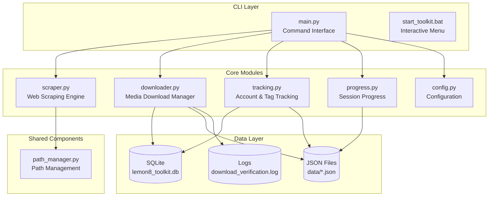
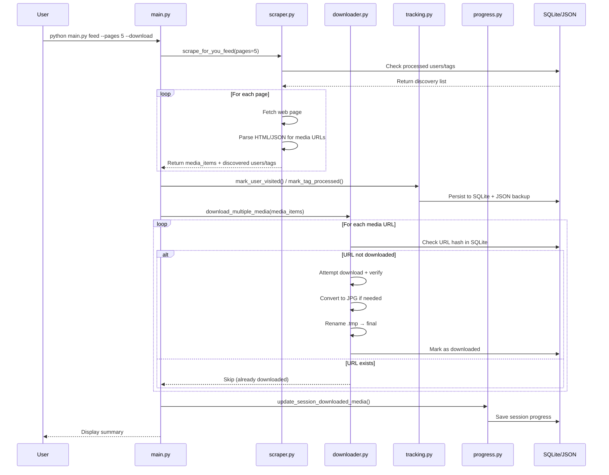

# Product Requirements Document (PRD)
# Social Media Media Scraping Toolkit

---

## 1. Executive Summary

**Project Name:** Social Media Media Scraping Toolkit  
**Project Type:** Python-based CLI application  
**Core Functionality:** Automated web scraping and media downloading from social media platforms with intelligent deduplication, crash-proof progress tracking, and multiple scraping modes.  
**Target Users:** Developers, researchers, and power users who need to collect media content from social platforms for analysis, archival, or personal use.

### Value Proposition
- **Three-in-one solution**: User profiles, trending feeds, and topic-based scraping in a single toolkit
- **Zero duplicate downloads**: SQLite-backed deduplication with JSON backup ensures media is never downloaded twice
- **Crash resilience**: Atomic file writes and temporary staging prevent data corruption
- **Production-ready**: Rate limiting, retry logic, and cookie authentication support

---

## 2. System Architecture

### 2.1 High-Level Component Diagram



### 2.2 Data Flow Architecture



### 2.3 Component Responsibilities

| Component | Responsibility | Key APIs |
|-----------|----------------|----------|
| `src/main.py` | CLI orchestration, argument parsing, mode routing | `Lemon8Toolkit` class |
| `src/scraper.py` | HTTP fetching, HTML parsing, media URL extraction | `Lemon8Scraper` class |
| `src/downloader.py` | File downloads, image conversion, deduplication | `MediaDownloader` class |
| `src/tracking.py` | User/tag state tracking, SQLite + JSON sync | `AccountTracker`, `TagTracker`, `UnifiedTracker` |
| `src/progress.py` | Session lifecycle, success rate tracking | `ProgressManager` class |
| `src/config.py` | Centralized configuration, URL patterns | Configuration constants |
| `src/path_manager.py` | Download path validation, session caching | `prompt_for_download_path()` |

---

## 3. Feature Matrix

### 3.1 Core Features

| Feature | Description | Status |
|---------|-------------|--------|
| User Profile Scraping | Scrape all media from any `@username` | ✅ Implemented |
| For You Feed Scraping | Discover and download trending content | ✅ Implemented |
| Tag/Topic Scraping | Scrape by numeric ID or keyword | ✅ Implemented |
| Keyword Tag Fallback | Auto-fallback to Discover for empty topics | ✅ Implemented |
| Media Download | Download MP4 videos and images | ✅ Implemented |
| WebP → JPG Conversion | Auto-convert WebP to Quality=100 JPG | ✅ Implemented |
| Deduplication | SQLite + JSON hybrid deduplication | ✅ Implemented |
| Progress Tracking | Session management with success rates | ✅ Implemented |
| Account Tracking | Track visited users and discovered users | ✅ Implemented |
| Tag Tracking | Track processed tag IDs | ✅ Implemented |
| Cookie Authentication | Netscape cookies.txt support | ✅ Implemented |
| Rotating User-Agents | Browser fingerprint rotation | ✅ Implemented |
| Rate Limiting | Configurable delays between requests | ✅ Implemented |
| Retry Logic | Exponential backoff for transient errors | ✅ Implemented |
| Crash Recovery | .tmp staging prevents partial files | ✅ Implemented |
| Atomic Writes | write-then-rename for JSON safety | ✅ Implemented |
| Interactive Menu | Windows batch launcher | ✅ Implemented |
| Statistics Dashboard | View toolkit usage stats | ✅ Implemented |
| Data Clearing | Reset all tracking/download history | ✅ Implemented |

### 3.2 Feature Configuration

| Feature | Configuration Key | Default |
|---------|-------------------|---------|
| High-quality image conversion | `IMAGE_ENHANCEMENT_ENABLED` | `True` |
| Image quality threshold | `HIGH_QUALITY_IMAGE_QUALITY` | `100` |
| Image dimensions | `HIGH_QUALITY_IMAGE_WIDTH/HEIGHT` | `2160` |
| Minimum image size | `MIN_IMAGE_WIDTH/HEIGHT` | `320` |
| Profile photo download | `PROFILE_PHOTO_DOWNLOAD_ENABLED` | `True` |
| Username prefix in filenames | `USERNAME_PREFIX_ENABLED` | `True` |
| Rate limit (seconds) | `MIN_DELAY/MAX_DELAY` | `1/3` |
| Requests per minute | `REQUESTS_PER_MINUTE` | `30` |

### 3.3 Scraping Modes Detail

#### Mode 1: User Profile (`python -m src.main user <username>`)
- **Input**: Username (with or without `@`)
- **Output**: Media URLs, related users, hashtags, topic IDs
- **Options**:
  - `--download`: Enable media downloading
  - `--force`: Re-scrape and process all tracked DB users
  - `--include-profile-photos`: Include author profile images
  - `--exclude-profile-photos`: Skip profile images

#### Mode 2: For You Feed (`python -m src.main feed`)
- **Input**: Number of pages to scrape
- **Output**: Media URLs, discovered users, discovered tags
- **Options**:
  - `--pages N`: Number of pages (default: 10)
  - `--download`: Enable media downloading
  - `--include-profile-photos`: Include author profile images

#### Mode 3: Tag/Topic (`python -m src.main tag <tag_id>`)
- **Input**: Numeric ID or keyword (e.g., `singapore`)
- **Output**: Media URLs, related users, related tags
- **Behavior**: Keywords auto-fallback to Discover URL when topic shows "No content"
- **Options**:
  - `--pages N`: Number of pages (default: 10)
  - `--download`: Enable media downloading
  - `--force`: Re-scrape even if already processed

---

## 4. Technical Specifications

### 4.1 Data Models

#### SQLite Schema

```sql
-- Media deduplication
CREATE TABLE downloaded_media (
    url_hash TEXT PRIMARY KEY,
    downloaded_at TEXT
);

-- User tracking
CREATE TABLE users (
    username TEXT PRIMARY KEY,
    first_visited TEXT,
    last_visited TEXT,
    visit_count INTEGER,
    total_media_found INTEGER,
    related_users_found INTEGER,
    tags_found INTEGER,
    metadata TEXT
);

-- Tag tracking
CREATE TABLE tags (
    tag_id TEXT PRIMARY KEY,
    first_processed TEXT,
    last_processed TEXT,
    process_count INTEGER,
    total_media_found INTEGER,
    related_users_found INTEGER,
    related_tags_found INTEGER,
    metadata TEXT
);
```

#### JSON Data Files

| File | Purpose | Schema |
|------|---------|--------|
| `downloaded_media.json` | URL hash backup | `{downloaded_urls: [], last_updated, total_count}` |
| `visited_users.json` | User metadata backup | `{username: {...}}` |
| `processed_tags.json` | Tag metadata backup | `{tag_id: {...}}` |
| `download_progress.json` | Session history | `{sessions: [], current_session}` |
| `download_verification.log` | Download audit log | Timestamped event entries |

### 4.2 API Contracts

#### Lemon8Scraper Class

```python
class Lemon8Scraper:
    def __init__(self, cookie_file: Optional[str] = None)
    def scrape_user_profile(self, username: str, ...) -> Dict[str, Any]
    def scrape_for_you_feed(self, pages: int = 10, ...) -> Dict[str, Any]
    def scrape_tag_topic(self, tag_id: str, pages: int = 10, ...) -> Dict[str, Any]
```

#### Return Structure

```python
{
    'media_urls': List[str],           # Raw URL list
    'media_items': List[Dict],         # Enriched media descriptors
    'discovered_users': Set[str],      # Users found (feed only)
    'discovered_tags': Set[str],       # Tags found (feed only)
    'hashtags': Set[str],              # Caption hashtags
    'tag_ids': Set[str],               # Numeric topic IDs
    'related_users': List[str],        # Mentioned users
    'related_tags': List[str],         # Related topic IDs
    'fallback_used': bool,             # Keyword fallback triggered
    'fallback_url': str,               # Fallback Discover URL
}
```

#### Media Item Structure

```python
{
    'url': str,                        # Media URL
    'username': Optional[str],         # Associated author
    'is_profile_photo': bool,          # Profile vs post media
    'media_type': str                  # 'image' or 'video'
}
```

### 4.3 Environment Variables

| Variable | Purpose | Required |
|----------|---------|----------|
| `LEMON8_COOKIE_FILE` | Path to cookies.txt | No (falls back to `./cookies.txt`) |

### 4.4 External Dependencies

| Package | Version | Purpose |
|---------|---------|---------|
| `requests` | >=2.25.0 | HTTP client |
| `beautifulsoup4` | >=4.9.0 | HTML parsing |
| `lxml` | >=4.6.0 | XML/HTML parser |
| `Pillow` | >=9.0.0 | Image conversion |
| `pylemon8` | git+... | (Optional) API client |

---

## 5. Security & Performance

### 5.1 Security Measures

| Measure | Implementation |
|---------|----------------|
| Cookie handling | File-based, never in code; excluded from git |
| Rate limiting | Configurable delays prevent server overload |
| User-agent rotation | Mimics real browser traffic patterns |
| Path sanitization | Filenames cleaned of invalid characters |
| Session management | Cookies loaded fresh per session |

### 5.2 Performance Characteristics

| Metric | Value |
|--------|-------|
| Deduplication check | O(1) via SQLite hash lookup |
| Image conversion | PIL/Pillow with quality=100 |
| Concurrent downloads | Sequential (1 at a time) |
| Memory footprint | Low (streaming downloads) |
| Disk I/O | Atomic writes prevent corruption |

### 5.3 Error Handling

| Error Type | Response |
|------------|----------|
| HTTP 429 (rate limit) | Exponential backoff, 3 retries |
| HTTP 500-504 (server error) | Retry with backoff |
| Network timeout | Logged, continue to next item |
| Image verification fail | Try enhanced URL candidates |
| Disk full | Graceful error with message |

---

## 6. Non-Functional Requirements

### 6.1 Error Handling Patterns

1. **Network Errors**: Logged to `download_verification.log`, retried up to 3 times with exponential backoff
2. **Parse Errors**: Graceful degradation, partial results returned
3. **Disk Errors**: User-friendly error messages, cleanup partial files
4. **API Blocking**: Automatic fallback from API to web scraping

### 6.2 Logging Strategy

| Log File | Content | Retention |
|----------|---------|-----------|
| `download_verification.log` | All download attempts with verification results | Append-only, grows indefinitely |
| `download_progress.json` | Session history | Pruned to last 100 sessions |

### 6.3 Data Integrity

1. **SQLite + JSON Sync**: On startup, JSON is merged into SQLite if missing
2. **Atomic Writes**: All JSON writes use write-then-rename pattern
3. **Crash Recovery**: .tmp staging ensures no partial downloads persist
4. **Backup**: Recent backup in `data/backup_YYYYMMDD/`

---

## 7. File Structure

```
lemon8toolkit/
├── src/                      # Python source modules
│   ├── __init__.py
│   ├── main.py               # CLI entry point
│   ├── config.py             # Configuration constants
│   ├── scraper.py            # Web scraping engine
│   ├── downloader.py         # Download manager
│   ├── tracking.py           # Account/tag tracking
│   ├── progress.py           # Session progress
│   └── path_manager.py       # Path management
├── scripts/                  # Windows batch scripts
│   ├── setup.bat             # Dependency installer
│   └── start_toolkit.bat     # Interactive menu launcher
├── tests/                    # Test suite
│   ├── test_scraper.py
│   ├── test_downloader.py
│   ├── test_main.py
│   └── test_integration.py
├── data/                     # Runtime data (not in git)
│   ├── lemon8_toolkit.db     # SQLite database
│   ├── downloaded_media.json # URL hash backup
│   ├── visited_users.json    # User tracking backup
│   ├── processed_tags.json   # Tag tracking backup
│   ├── download_progress.json
│   ├── download_verification.log
│   └── backup_YYYYMMDD/       # Periodic backups
├── requirements.txt
├── .gitignore
└── README.md
```

---

## 8. Future Considerations

| Item | Priority | Notes |
|------|----------|-------|
| Async downloads | Medium | Could improve throughput |
| Plugin architecture | Low | Support for additional platforms |
| Cloud storage integration | Low | S3/GCS support |
| Web UI dashboard | Low | Flask/React frontend |
| Parallel scraping | Low | Multi-process page fetching |

---

*Document Version: 2.0*  
*Generated: 2026-04-26*