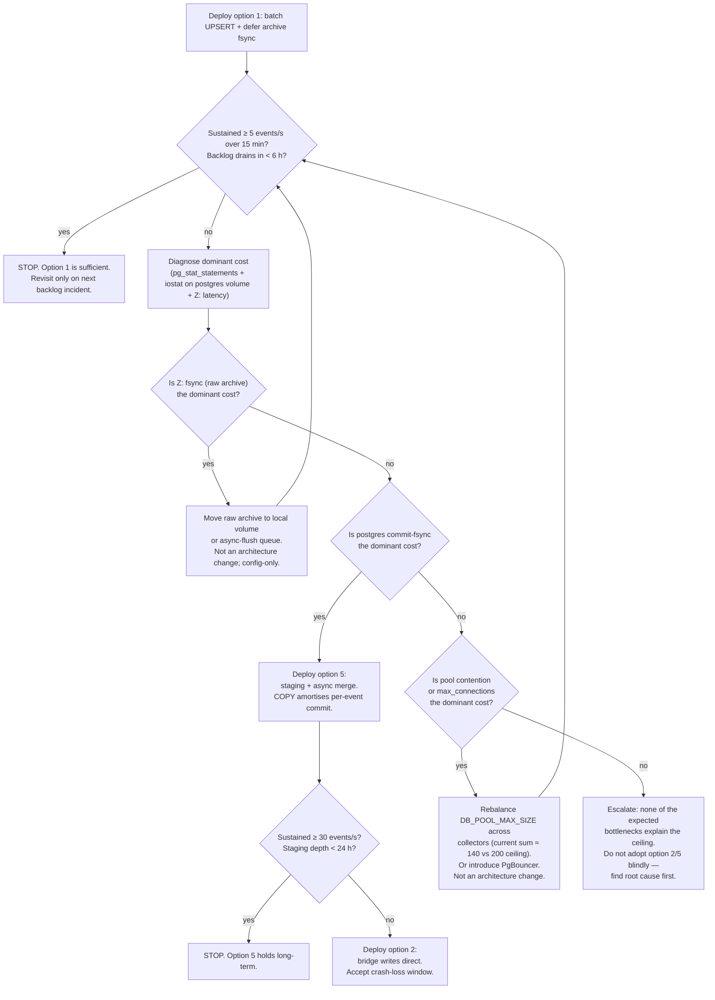

# Plan: WhatsApp contact-event ingest — architecture alternatives

Evaluates seven architectural options for the WhatsApp `contacts.update` ingest
path in response to the observed 2026-09-07 backlog (108k events, 0.26 events/s
sustained, ~300 ms per `whatsapp_users` UPSERT). Companion plans cover batching
and query opt as a status-quo tactical fix; this doc scopes the strategic
question: **is the current pipeline shape still the right one?**

## 1. Current state (evidence)

Bridge → RabbitMQ → collector → Postgres. All in one docker-compose stack, one
Postgres instance, solo operator.

| Component | Evidence |
|---|---|
| Bridge publisher | `src/bridges/whatsapp/src/event_handlers/contacts.ts`, `src/bridges/whatsapp/src/producer.ts` — one AMQP publish per contact, routing key `contacts.update`, exchange `whatsapp.events` (topic, durable, `persistent: true`, `createConfirmChannel`). |
| Consumer bind | `src/collectors/whatsapp/__init__.py:408` — queue `unifiedcollector.contacts` bound `contacts.#`, `WA_CONSUMER_CONTACTS_CONCURRENCY=4` parallel iterators. |
| Per-event work | `_handle_contact_event` (line 631): `_archive_raw_event` → `os.fsync` write to `Z:/unifiedcollector/vault/...` **plus** `report_raw_archive_result` (audit-row INSERT) **plus** `whatsapp_users` UPSERT (line 693) **plus** optional `whatsapp_lid_map` UPSERT (line 706). 3–4 sequential I/O hops per event, none batched. |
| Pool | `src/db/connection.py` — asyncpg pool, `min_size=1`, `max_size=20` (whatsapp override), `command_timeout=60`, shared postgres `max_connections=200`. |
| Schema | `src/db/schemas/whatsapp.sql:16` — `whatsapp_users.platform_user_id UNIQUE`; `whatsapp_lid_map.lid PRIMARY KEY`. Both UPSERTs use `COALESCE(EXCLUDED.x, existing.x)` — index-heavy path on update. |

**Cost-attribution note.** 4 workers × 300 ms = ~13 events/s theoretical if
UPSERT were the whole cost. Observed 0.26/s means the wall-clock per event is
closer to 15 s, not 300 ms. The fsync-to-`Z:` archive write and the audit-row
INSERT are both prime suspects for the ~50× gap. Any option evaluated below
that leaves those two costs in place inherits their ceiling. This is called
out per option.

## 2. Options summary

| # | Option | Throughput ceiling | Operator complexity | Migration cost |
|---|---|---|---|---|
| 1 | Status quo + batch + query opt | ~50–200/s (with archive deferred; ~15/s if archive stays inline) | Same as today | 1–2 dev-days |
| 2 | Bridge writes direct to Postgres | ~150–500/s | +1 codepath (Node pg driver, backpressure, crash-loss window) | 3–5 dev-days |
| 3 | Dedicated Go/Rust worker | ~200–500/s | +1 language, +1 service, +1 image | 8–12 dev-days |
| 4 | Postgres LISTEN/NOTIFY | ~50–100/s (NOTIFY serializes on commit; 8 KB payload cap) | Same infra; new plpgsql surface | 3–4 dev-days |
| 5 | Staging table via COPY + async merge | Bridge writes ~5000/s; merge ~50–200/s but amortized | Same services; +1 table, +1 background job | 4–6 dev-days |
| 6 | Kafka Connect / RabbitMQ Postgres sink | ~10000/s but no `ON CONFLICT` semantics | +JVM in stack, config-heavy, +1 process to babysit | 5–8 dev-days |
| 7 | Ditch RabbitMQ, use Redis Streams | ~50000/s on write; consumer-side unchanged | Rewrite broker abstraction across contacts + messages + groups + sessions | 8–12 dev-days |

**Effort + confidence.**

| # | Option | Effort | Confidence |
|---|---|---|---|
| 1 | Status quo + batch | 1–2 dev-days | HIGH |
| 2 | Bridge direct | 3–5 dev-days | MEDIUM |
| 3 | Go/Rust worker | 8–12 dev-days | LOW |
| 4 | LISTEN/NOTIFY | 3–4 dev-days | LOW |
| 5 | Staging + merge | 4–6 dev-days | MEDIUM-HIGH |
| 6 | Kafka Connect | 5–8 dev-days | LOW |
| 7 | Redis Streams | 8–12 dev-days | LOW |

## 3. Recommendations

### Near-term — Option 1: status quo + batching + query opt + archive deferral

**Rationale.** The bottleneck is not the pipeline shape. It's the per-event
work: 3–4 sequential I/O hops per contact, none of which need to happen
synchronously with the AMQP ack. Fix the per-event work and 108k drains in
hours, not days.

Concretely (out of scope for this doc, but the design assumption behind the
recommendation):

- Batched UPSERT via `INSERT ... SELECT * FROM unnest($1::text[], $2::text[], ...) ON CONFLICT ... DO UPDATE`. Coalesce N events (e.g. 50–100) per DB round-trip. Amortises commit fsync N-fold.
- Defer or async the `_archive_raw_event` fsync: either write to a local volume (not `Z:`) or move the write off the consumer coroutine into a background flush queue.
- Coalesce the audit-row insert (`report_raw_archive_result`) into the same batched round-trip, or drop for contacts specifically — the raw archive already carries the same provenance.
- Keep `WA_CONSUMER_CONTACTS_CONCURRENCY=4` but expect the batch handler to naturally serialize per-worker, so consider dropping to 2.

Why this over option 5 today: option 1 preserves every other invariant — the
`whatsapp.events` topic exchange, the `messages.#` / `groups.#` / `sessions.#`
bindings, the raw-archive contract, the `whatsapp_lid_map` merge semantics —
and gets a probable 20–50× throughput lift from a 1–2 day change. Option 5
touches the schema, adds a background job, and needs backfill semantics; it
should be reserved for after option 1 has been measured and found insufficient.

**Success gate.** Sustained ≥ 5 events/s over a rolling 15-min window during
history-sync. 108k backlog drains in < 6 h. If both hold, stop.

### Long-term (only if option 1 hits its own ceiling) — Option 5: staging table + async merge

**Rationale.** If commit-fsync on the postgres volume is dominant even after
option 1 has coalesced round-trips, decouple the AMQP ack from the merge.
Bridge (or consumer) writes an append-only JSONB row to
`whatsapp_contact_events_staging` via `COPY`; a background merger consumes
staging in large batches and applies the `ON CONFLICT` merges to
`whatsapp_users` + `whatsapp_lid_map`. COPY at ~5000 rows/s eliminates the
per-message commit cost as a bottleneck for the write path; the merger runs at
whatever pace the DB can sustain, decoupled from freshness pressure.

This is preferred over option 2 (bridge direct) at the long-term horizon
because it retains RabbitMQ as the crash-safety buffer and keeps all
`ON CONFLICT` logic in Python where it lives today. Option 2 is a valid
fallback if option 5 proves too heavy — see decision tree §5.

**Success gate.** Sustained ≥ 30 events/s during history-sync. Staging table
depth never exceeds 24 h of production data.

## 4. Explicit rejections

The following options don't fit unifiedcollector's operator model — solo
operator (bryan), docker-compose only, no ops team, one Postgres, no JVM in
the stack. They are documented here so future iterations don't rediscover the
same reasons.

### Option 3 — Dedicated Go/Rust microservice: **rejected**

- Adds a new language surface. The whole collector fleet is Python + one Node bridge; a third runtime doubles the "which container do I `docker exec` into" cognitive load without a matching win.
- The DB-write bottleneck isn't Python overhead. asyncpg + coalesced UPSERT hits ~50–200/s comfortably; you don't need Rust for a 5000/s write path when a COPY-batched Python worker gets you there too (option 5).
- New Dockerfile, new CI pipeline, new dependency-scanning surface, new failure mode. Solo-operator budget cannot absorb a service without a 5×+ win over the alternatives, which this does not have.

### Option 4 — Postgres LISTEN/NOTIFY: **rejected**

- `pg_notify` fires only on transaction commit. The bridge would need to open a Postgres connection *per event*, `BEGIN` / `NOTIFY` / `COMMIT`, and every notify is serialized on the commit log. Ceiling is worse than the status quo, not better.
- The 8 KB payload cap forces a re-fetch pattern (NOTIFY with an event ID, LISTEN worker `SELECT`s the row). That's two DB round-trips per event to save one AMQP hop. Net loss.
- Loses the RabbitMQ crash-safety buffer without replacing it — a Python consumer that isn't LISTENing during a restart window misses events entirely (NOTIFY is not durable).
- Right tool for low-volume in-DB triggers, wrong tool for a 100k-event stream.

### Option 6 — Kafka Connect / off-the-shelf sink connector: **rejected**

- Requires a JVM in the stack. WSL2 + docker-compose on a single laptop already runs 15 containers within a 32 GB RAM budget; adding a Kafka Connect worker (typically ~1 GB baseline) is disproportionate.
- Sink connectors do straight INSERTs, not `ON CONFLICT ... DO UPDATE` with `COALESCE`-per-column merge semantics. The custom merge is the interesting part of the pipeline; a generic connector doesn't solve it.
- Config surface is heavy (topic mappings, converter classes, dead-letter queues) — solo operator cannot afford it.

### Option 7 — Ditch RabbitMQ for Redis Streams: **rejected**

- The `whatsapp.events` topic exchange isn't just contacts. `messages.#`, `groups.#`, and `session.#` all ride the same exchange. Migrating one channel to Redis Streams forks the transport model; migrating all four is an 8–12 day rewrite for a pipeline where the transport isn't the bottleneck.
- Redis is already in the stack for `realtime_feed`, but adding a Streams consumer-group runtime, ack semantics, and DLQ equivalent duplicates work RabbitMQ does correctly today.
- Redis Streams peaks at ~50000 writes/s. The observed problem is 0.26 writes/s. The transport is 190000× overprovisioned already; the bottleneck is downstream.

### Option 2 — Bridge writes directly to Postgres: **deferred, not rejected**

Kept as a fallback for the long-term horizon (see §5 decision tree). Not
rejected because it *would* work; deferred because it introduces:

- A second codepath that must implement the same `ON CONFLICT` + `COALESCE` merge semantics — now maintained in TypeScript and Python.
- A crash-loss window: a bridge that dies between accepting an event from Baileys and committing to Postgres loses that event, whereas today RabbitMQ persists it.
- Ties the bridge's health to Postgres availability. Today the bridge stays green while Postgres restarts; RabbitMQ absorbs the queue. This is a real property of the current design that would be given up.

The right time for option 2 is if option 5 proves too heavy *and* option 1 has
demonstrably plateaued.

## 5. Decision tree

**Trigger phrases for each branch.**

| Observation | Adopt |
|---|---|
| Sustained ≥ 5/s after option 1, 108k drains in < 6 h | Nothing. Stop. |
| `iostat` shows Z: write latency > 50 ms p50 during ingest | Fix archive path (config, not architecture). |
| `pg_stat_statements` shows COMMIT time dominant, per-tx latency > 5 ms | Option 5 (staging + merge). |
| `pg_stat_activity` shows connection wait > 100 ms p95, or `active` count pinned at pool max | Rebalance pool sizes or add PgBouncer. Not architecture. |
| Option 5 is deployed and *still* plateaus below 30/s | Option 2 (bridge direct), accept crash-loss trade-off. |
| None of the above fits | Do not adopt option 2/3/5 blindly. Root-cause first. |

## 6. Non-goals

- This doc does not spec option 1's batching implementation. See the companion
  batching plan (produced by a separate sub-agent) for the DDL/query shape.
- This doc does not spec option 5's staging schema, merge cadence, or backfill
  semantics. If option 5 is triggered by §5, a follow-up plan is required
  before implementation.
- This doc does not spec the raw-archive-deferral fix. That is a config /
  small-code change, not an architectural decision, and belongs in a bug-fix
  ticket.

## 7. Open questions (resolve before Option 5)

1. Is `whatsapp_contact_events_staging` durable enough to survive a Postgres restart mid-merge, or does it need a WAL-shipping story? (Default assumption: yes, ordinary UNLOGGED-vs-LOGGED tradeoff.)
2. Does the analyzer's `entity_platform_links` join require freshness < 5 min for LID→phone resolution? If yes, merge cadence must be tuned to match; if no (typical case), a 15-min merger tick is fine.
3. Under what backlog depth does staging itself become a operator concern? (i.e. what's the alarm threshold on `SELECT count(*) FROM whatsapp_contact_events_staging WHERE merged_at IS NULL`?)

None of these block a decision on the near-term recommendation.

## 8. Rollback

Every option in the accepted set (1, 5, 2) is rollback-safe:

- Option 1: revert batching commit, revert consumer concurrency, re-enable inline archive. Ceiling returns to today's 0.26/s but no data lost.
- Option 5: stop the merger, disable the staging producer, drain staging via a one-off merge run, drop staging table. Data path returns to option 1.
- Option 2: re-enable the RabbitMQ contacts path, disable the bridge's direct-write codepath. Bridge crash-loss window closes on rollback.
